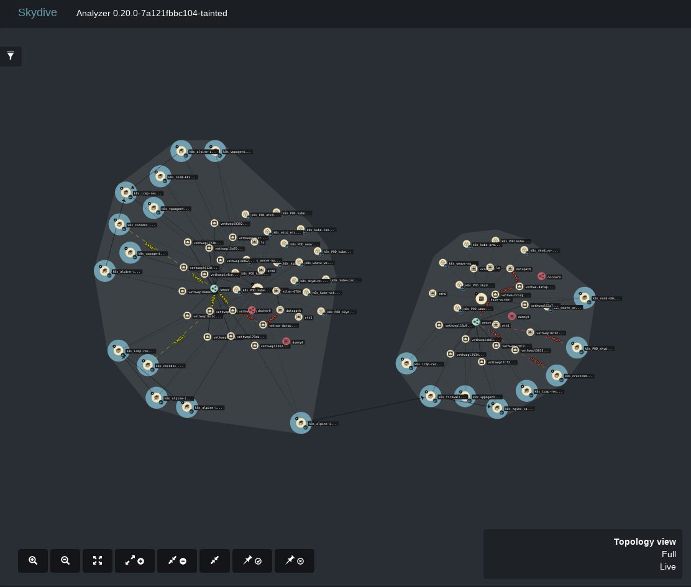
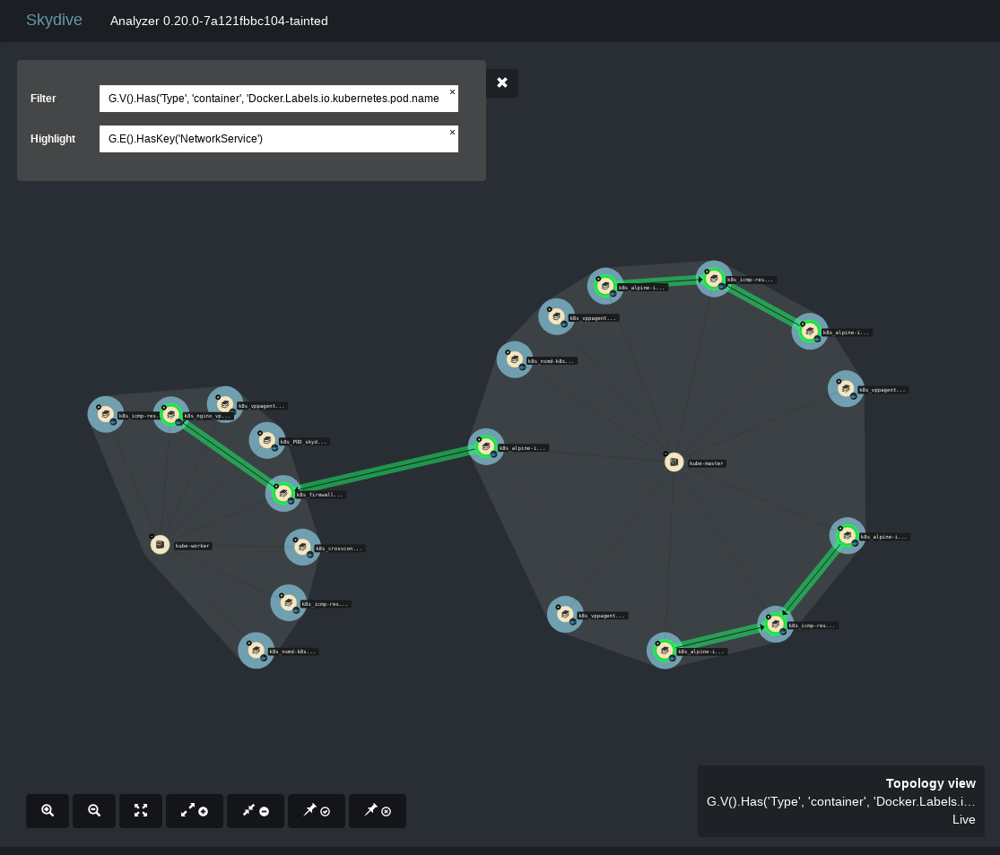

# Using Skydive to visualize NSM concepts

It is always tricky for infrastructure projects, and especially networking infrasctructure projects, to explain their concepts, and what the project does effectively.
One always better understands concepts he can visualize over those explained with hundreds of words.
It is even harder for networking infractructure projects that introduce new way of interconnecting components across the underlying infrastructure. That's what the network service does.

To tackle down this situation, we use [Skydive](http://skydive.network).

## Skydive

Skydive is an opensource project for monitoring and troubleshooting cloud networking. It displays the networking topology with d3js.

Find more informations about Skydive on the [documentation page](http://skydive.network/documentation/) or on the [github page](https://github.com/skydive-project/skydive).

Skydive relies on probes to retrieve datas and create the topology. Such probes exists for Docker, Openstack, Linux networking components (interfaces, network namespaces...).

Hence, in order to inject NSM datas to the topology we had to develop a dedicated probe.

## The NSM probe

To simplify the usage of the Skydive topology graph, we decided to run the NSM probe from the central component of Skydive, the analyzer. The probe will then be notified of any new element, such as Linux networking namespaces or Docker containers, entering the graph.

The probe also has to listen to NSM events, such as point to point connections created by NSM between two pods. To this purpose, each NSM daemon is sending monitoring events over a grpc stream channel.

The probe will list NSM daemons available in the NSM domain. In the kubernetes context, this is done by asking the kubernetes API for registered NSM daemons. The NSM probe then connects to each one of them, and listen to monitoring events.

NSM daemons tell the probe about which pods are cross connected, with the linux networking namespace inode number of each pod. Since Skydive is naturally monitoring networking namespaces, docker containers, and kubertnetes pods, we will be able to create new links between Skydive nodes representing those pods. Those links will reprensent the cross connect links created by NSM.

With the help of the Skydive team, we managed to find the correct filter to only display NSM elements in the graph, and highlight the crossconnect links.

Thanks to Skydive with a NSM probe embedded, we can easily visualize cross connect link, in green, created by NSM.

## Follow-up

The source code of the probe is available on this [Skydive fork](https://github.com/Orange-OpenSource/skydive/tree/nsm). We aim at merging this branch in the Skydive main repository, once every monitoring events will be correctly handled.

Even if NSM is dataplane agnostic, for now, it relies on VPP. Having a VPP probe in Skydive would allow us to have more informations to troubleshoot such a deployment.
